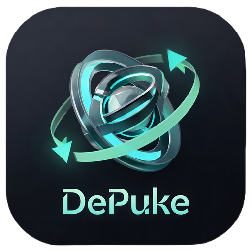

<div align="center">



# 🚗 DePuke
### *Stop barfing in the passenger seat. iOS 18 Vehicle Motion Cues, backported to iOS 15 & 16.*

[](https://github.com/dnullptr/DePuke)
[](https://github.com/dnullptr/DePuke)
[](LICENSE)

</div>

---

## 👀 The Story
Look, we’ve all been there: you’re riding shotgun or stuck in the back of an Uber, scrolling TikTok or reading some endless tweet thread, and suddenly your stomach starts doing backflips. 

Apple dropped **Vehicle Motion Cues** in iOS 18 to fix sensory conflict by putting animated edge dots that sway with the car’s G-forces so your brain doesn’t think you're getting poisoned.

**DePuke** brings that exact feature straight to your jailbroken iOS 15.0 – 16.5+ device. No iOS 18 update needed. No forced stock OS. Just smooth, pure motion relief.

---

## ✨ Features (The Juice)

- 🪄 **System-Wide Invisible Overlay**: Runs on top of SpringBoard, Lockscreen, Notification Center, and inside every single 3rd-party app without stealing a single tap. All your gestures and touches pass straight through.
- 🎯 **Real Hardware CoreMotion Sampling**: Hooks directly into your iPhone's accelerometer & gyro at up to 120Hz (ProMotion smooth).
- 🧠 **Low-Pass Filtered (LPF) Physics**: Cuts out micro-jitters, road cracks, and hand tremors. The dots only react to genuine vehicle acceleration, braking, and hard cornering.
- 🏎️ **Vehicle Auto-Detect (CoreMotion)**: Automatically spins up the dots only when Apple's activity engine detects you’re actually in a moving vehicle.
- 🎨 **Fully Customizable Aesthetics**:
  - Dot count (4, 8, 12, 16 dots)
  - Radius / Size slider
  - Opacity & Theme presets (iOS 18 Dark, Clean Light, Neon Cyan Glow)
  - G-force sensitivity & max travel offset
- ⚡ **Zero-Respring Live Reloading**: Tweaking preferences in Settings takes effect instantly via Darwin notifications.

---

## 🔬 How the Physics Work

Motion sickness happens when your eyes say *"we're sitting still looking at a phone"* but your inner ear (vestibular system) says *"bro, we're doing 70mph around a sharp bend"*.

DePuke counters this with inverted visual inertia:

| Vehicle Action | G-Force Direction | DePuke Dot Reaction |
| :--- | :--- | :--- |
| **Accelerating forward** | Pushes back into seat | Dots slide **downward** |
| **Braking / Decelerating** | Pushes forward | Dots slide **upward** |
| **Turning Left** | Centrifugal force pulls right | Dots slide **right** |
| **Turning Right** | Centrifugal force pulls left | Dots slide **left** |

---

## 📲 Installation

### Requirements
- A jailbroken device running **iOS 15.0 – 16.5+** (or iOS 16.6 beta).
- Modern Rootless jailbreak: **Dopamine**, **Palera1n (Rootless)**, or **XinaA15 v2**.
- Package managers: **Sileo** / **Zebra**.

### Grab the `.deb`
1. Download the latest `com.dnullptr.depuke_*.deb` from the [Releases](https://github.com/dnullptr/DePuke/releases) tab (or GitHub Actions artifacts).
2. Open in **Sileo** / **Zebra** and hit **Get / Install**.
3. Respring and jump into **Settings → DePuke** to dial in your prefs.

---

## 🛠️ Building from Source

Got Theos set up? Compiling takes two seconds:

```bash
# Clone the repo
git clone https://github.com/dnullptr/DePuke.git
cd DePuke

# Build rootless package
make clean
make package FINALPACKAGE=1 THEOS_PACKAGE_SCHEME=rootless
```

The compiled package will drop into the `packages/` directory ready to install via `make do` or AirDrop.

---

## ⚙️ Configuration & Options

Inside `Settings.app` → `DePuke`:

- **Enable Motion Cues**: Master toggle on/off.
- **Only in Vehicle (Auto)**: Background CoreMotion engine only turns it on when inside a car/bus/train.
- **Visual Theme**: Switch between Apple Dark, Clean Light, or Cyan Accent.
- **Dot Count**: Choose between 4 to 16 edge tracking dots.
- **Sensitivity & Smoothing**: Tune the responsiveness to your car’s suspension stiffness.

---

## 🤝 Credits & Shoutouts

- **Apple** for the original iOS 18 Vehicle Motion Cues concept.
- **Theos Team** for the modern build system & toolchains.
- **Opa334 & the Dopamine team** for keeping the rootless jailbreak scene alive and kicking.

---

<div align="center">

Made with ❤️ and motion sickness pills by **dnullptr**.

</div>
